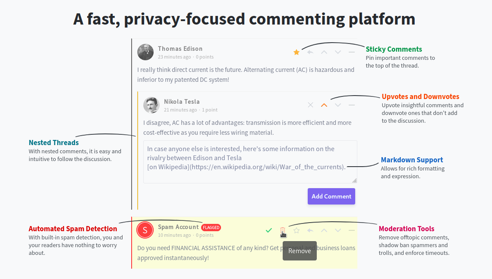

[//]: # "pandoc input.md -t beamer -o output.pdf"
[///]: # "musíš mít nainstalovaný latex"

# API

* chceme vytvořit interní API službu pro správu informací o projektech, členech projektů, činnostech, vykazováních atd.
* chceme nahradit Achievo, které není moc user-friendly
* chceme ho nahradit webovou aplikací, která obsluhuje znovupoužitelné API
* v této aplikaci chceme implementovat nějakou commenting service

# Commento

* padl tu návrh na použití [**Commenta**](https://commento.io/) jako comment servisu
* používá se embednutím CDN do generované stránky, takže určitě použitelné pro dynamické stránky
* není zadarmo, platí se za měsíc a maximální počet požadavků na CDN za měsíc je 50 000
* [**tady**](https://commento.io/pricing) je ceník

#

# Timecamp

* byl tu návrh na průzkum možnosti nahrazení Achieva [**Timecampem**](https://www.timecamp.com/)
* řeší time tracking
* sleduje činnosti v projektech, takže pro Trask použitelný datový model
* je to SaaS, takže pokud chceme interní službu, tak není použitelný
* [**tady**](https://www.timecamp.com/en/pricing/) je ceník

#

# Frameworky
* vybíráme si framework, ve kterém napíšeme CRUD s lepším UI a zabudovaným API
* rozdělené podle jazyka, v kterém jsou implementované
* všechny jsou open-source a zadarmo
* uvažujeme jenom PHP a Node JS

# PHP

* minimálně já (Petr N.) a Daniel bysme v tom byli schopní psát
* už je to trošku starší záležitost

# Agile Toolkit
* OOP PHP framework
* [**odkaz**](https://github.com/atk4) na Github
* [**odkaz**](https://www.agiletoolkit.org/) na jejich stránky
* řeší API, UI, persistenci, správu uživatelů
* vlastní knihovna pro generování grafů atd.
* db je MySQL (dal by se znovupoužít datový model z Achieva)
* není vývojově mrtvý
* i ty výchozí grafické výstupy z něj vypadají v pohodě

#

# Node JS

* musel bych se doučit
* lepší do budoucna

# Allcount JS

* [**odkaz**](https://allcountjs.com/) na jejich stránky
* umí správu uživatelů, API, UI, CRUD
* od roku 2016 vývojově mrtvý
* lepší spíš pro prototypování než do produkce

# Quorra JS

* [**odkaz**](https://quorrajs.org/) na jejich stránky
* [**tady**](http://109.239.60.130/compare/quorrajs/vs/agile-toolkit) srovnání s Agile Toolkitem
* od roku 2018 vývojově mrtvá

# Sails JS

* [**odkaz**](https://sailsjs.com/) na jejich stránky
* nový framework postavený na Expressu
* použitím se dost podobá Railsům
* řeší API, UI, persistenci, správu uživatelů
* hezká [dokumentace](https://sailsjs.com/documentation/reference)

#

# Express JS

* dalo by se pracovat jenom s Expressem
* minimalistický framework pro Node JS
* [**srovnání**](http://109.239.60.130/compare/sails-js/vs/express-web-framework) se Sails JS

# Shrnutí

Moji favoriti:

1. Agile Toolkit
2. Sails JS
3. Express JS

* ATK, když nebude vadit PHP
* Sail JS, když nebude vadit něco jako Ruby on Rails, v čem to bude rychle hotové
* jinak Express JS